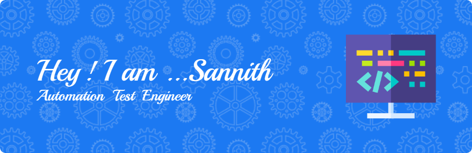

<h1 align="center">Hi 👋, I'm Sannith Reddy Lingampelly</h1>
<h3 align="center">A passionate Automation Test Engineer from India</h3>

  

- 🔭 I’m currently working on **Hybrid Framework for Automation Testing**

- 🌱 I’m currently learning **DevOps, Python, AI & API Rest Assured Framework**

- 👯 I’m looking to collaborate on **e-Banking Project**

- 🤝 I’m looking for help with **API testing with Rest Assured**

- 💬 Ask me about **Core Java, SQL,TestNG, Selenium, BDD, Data Driven, Cucumber, GitHub, Git, Jenkins**

- 📫 How to reach me **sannithreddy075@gmail.com**

<h3 align="left">Connect with me:</h3>

<h3 align="left">Languages and Tools:</h3>

             

&nbsp;

<
